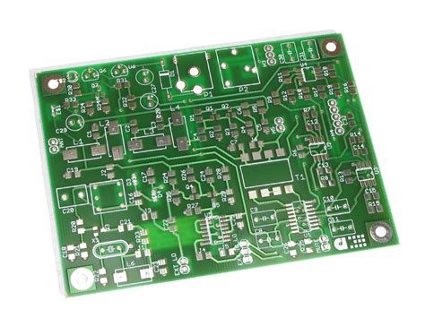

# TESTE GITHUB

Repo teste para introdução ao Github

# Título do Projeto

- Autores: Nome + RA
- Professor:
- Disciplina:
- Instituição:

## Introdução

Uma breve introdução sobre o projeto
Materiais e Recursos

materiais e recursos utilizados para desenvolvimento do projeto

## Esquema Elétrico

Esquema elétrico da solução ou diagrama de blocos

## Código fonte

Código Fonte da aplicação desenvolvido com FreeRTOS

## Explicação do código Fonte

Explicação sobre os principais pontos do código

## Conclusão

Conclusão sobre o projeto e sobre o uso de FreeRTOS.

## Referências

Referências usadas para desenvolvimento do projeto

## Licença do projeto

Licença de publicação do projeto. Anexar a licença ao repositório.
